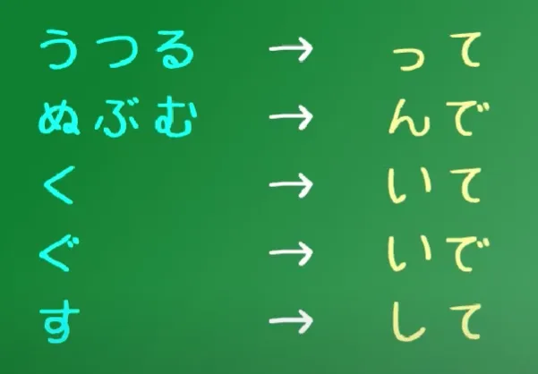

# Học N6 (Tiếng Nhật hữu cơ)

Mình muốn bắt đầu trước khi cả học N5 là N6, tức những cái hiểu rất cơ bản và có hệ thống của Tiếng Nhật. Lý do khiến cho việc học Tiếng Nhật của mọi người trở nên khó khăn là do mọi người chưa được dạy đúng cách.

Trích dẫn ghi chú từ khóa Ngữ pháp hữu cơ của Cure Dolly. Bản dịch Tiếng Việt cho cả cuốn thì chưa có đâu vì lười lắm. Khi nào có sẽ để đường dẫn sau.

### Bài 1: Cấu trúc câu cơ bản

Trong mọi câu Tiếng Nhật đều có hai thành phần cơ bản nhất hay còn được gọi là câu chính (Theo Cure Dolly thì nó là core sentence, nhưng mình sẽ gọi nó là câu chính). Hãy thử hình dung nó như một đoàn tàu. Cấu trúc câu cơ bản bao gồm 2 phần: Toa tàu A và Đầu tàu B.

Có hai kiểu câu chính:
- A là B (Không phải hành động: Trạng thái, cảm xúc, định nghĩa.....) - A is B (Tiếng Việt mình không có từ nào tương ứng với "be" nên phần này mình đặt tạm là "A là B" và giải thích thêm).
- A thực hiện hành động B (Ngược lại) - A does B.

Bạn có thêm "phụ gia" vào bất kì A hay B, biến thành câu phức, thêm nội dung hay làm bất cứ điều gì thì cấu trúc câu chính vẫn chỉ được quy về A và B.

Sẽ có các kiểu câu chính trong Tiếng Nhật như sau:

- Câu động từ: さくらがあるく - Sakura đi bộ (Khi động từ chính là Đầu tàu B)
- Câu hệ từ: さくらが日本人だ - Sakura là người Nhật (だ gần tương đương với です, có những điểm khác nhau nhất định mà ta sẽ bàn tới sau). Về cơ bản chữ だ này được coi là một dấu bằng, kiểu さくら = 日本人 (A là B - A is B ở trên)
- Câu tính từ: ペンが赤い/あかい - Bút màu đỏ (Tại sao không có だ ở đây? Là do chức năng của だ đã được tích hợp vào trong tính từ rồi. Nghe khá khó hiểu nhưng bạn về cơ bản sẽ không được thêm だ nếu B là tính từ). 

### Bài 2

Điểm đỉnh của hiểu nhầm trong ngữ pháp Tiếng Nhật.

Đọc từ Bài 1 thì ta đã biết rằng là trong mọi câu Tiếng Nhật đều có chung một kiểu câu chính, dù có thêm nhiều "toa tàu" để khiến cho con tàu (câu) trở nên phức tạp, cũng vẫn sẽ chỉ có thể quy về một kiểu câu chính.

Không phải bao giờ bạn cũng nhìn được toa tàu chính (Toa A) vì nó được thay thế bằng toa tàu ẩn. Bây giờ sẽ là phần giải thích.

Nếu xét trong Tiếng Anh thì từ gần với toa tàu vô hình nhất là "it", còn trong Tiếng Việt thì có thể coi chủ ngữ là toa tàu vô hình. Thử xét đoạn văn sau:

> Tôi ăn bánh
>
> Tôi uống trà
>
> Tôi thật quý's tộc's

Không ai viết dài dòng như này cả, có thể tóm gọn thành:

> Tôi ăn bánh và uống trà, sống một cuộc đời thật quý's tộc's.

Có khó hiểu không khi bỏ "tôi" đi? Hoàn toàn không. Điều này cũng tương tự trong Tiếng Nhật, toa tàu chính A sẽ luôn ở đó, kể cả khi nó "có tàng hình" đi nữa.

**ドリーだ** - Tôi là Dolly, không có toa tàu A trong câu là vì nó đã được ẩn đi. Câu đầy đủ phải là **(Không が) ドリーだ**.

Cái "(Không が)" này sẽ được tự động cập nhật theo ngữ cảnh. Nó sẽ giống như thế này:

> Mày ăn cơm chưa?
>
> (Tao) ăn rồi (Chỉ cần nói "ăn rồi" là đủ).
> 
> (Mày) láo thật (Không cần nói "mày" thì cái đứa "mày" kia cũng biết là câu này đang ám chỉ nó).

Đó, nó sẽ tự thay đổi theo ngữ cảnh :)). Trong Tiếng Nhật thì có "(Không が)ウサギだ!" - Đó là con thỏ.

### Bài 3
**Trợ từ は**. Nếu theo cái cấu trúc ở trên thì thì ví dụ như câu "わたしはアメリカ人だ" (As for me, I am an American).

> The は particle can never be a part of the core sentence. It can never be one of the black carriages, the main car A (the thing we are saying something about) or the engine B (the thing we are saying about it).
> 
> And a は-marked noun is never part of the logical structure of a sentence. は is a non-logical particle.

Nó giống như một cái lá cờ và được sử dụng để đánh dấu chủ đề của câu.

### Bài 4

Trước đó cần nói về thì *không phải quá khứ*, thường thể hiện những sự kiện/hành động trong tương lai.

> So, the Japanese non-past tense is very similar in the way it functions to the English non-past tense. If you understand one you can pretty much understand the other. Most of the time, the Japanese non-past tense refers to future events

Để thể hiện hành động đang diễn ra ở hiện tại, ta sẽ sử dụng いる. いる có nghĩa là *in relation to animals and people*. Ví dụ như: さくらがあるいている - Sakura đang đi bộ.

Để thể hiện quá khứ: Fortunately that's very easy indeed. All we do is add た – that's the whole thing. So, いぬがたべる – dog will-eat / いぬがたべた – dog ate (Now, there are different ways of attaching た to different kinds of verb, verbs with different endings, but the good news here is that they are exactly the same as the ways that you attach て)

Về mệnh đề thời gian:

- Now, tomorrow is what we call a **relative time expression** because it's relative to today. Today is yesterday's tomorrow (Không cần に)
- **absolute time expression**: an expression that is not relative to the present, such as Tuesday or six o'clock, cần dùng に.

### Bài 5
Bài này là một bài quan trọng, và mong là mình sẽ viết được nó đủ tốt

Nhóm động từ đầu tiên được gọi là nhóm Ichidan (一段 - Bậc một) hay động từ đuôi いる/える (Có một số người gọi là động từ đuôi -る nhưng nó chưa đúng). Muốn thay đổi thì chỉ cần bỏ -る và thêm て hoặc た.

Nhóm động từ thứ hai được gọi là nhóm Godan (五段 - Bậc 5), they can end in any う-sound, including -いる or -える. Unlike ichidan verbs, they can also end in -おる, -ある or -うる (Phần lớn động từ đuôi いる/える là Ichidan, có một số nhỏ là Godan, bạn có thể xem thêm [video này của Cure Dolly](https://www.youtube.com/watch?v=VDmaSJ4s6Qo) để tìm hiểu thêm).

Nhóm động từ bất nguyên tắc: Chỉ có hai động từ bất nguyên tắc thôi, đó là くる (come) and する (do).

Về cơ bản thì ba nhóm động từ là vậy, bây giờ sẽ chuyển sang phần chuyển đổi thể động từ. Cách làm cho Ichidan thì siêu đơn giản, chỉ cần bỏ -る và thêm て hoặc た.

Còn với Godan thì phức tạp hơn chút xíu.

**Nhóm Godan 1 - UTSURU/うつる**:  We take off the -う, the -つ or the -る, and we replace it with a small -っplus て (or た in the た-form).

- So わらう - laugh, becomes わらって (Waratte);
- もつ - hold, becomes もって (Motte);
- and とる - take, becomes とって (Totte).

**Nhóm Godan 2** - dull sound – ぬ, ぶ, む: The て-form ending is -んで, the た-form is -んだ.

- So しぬ, the only -ぬ ending verb, becomes しんで / しんだ;
- のむ - drink, becomes のんで / のんだ
- あそぶ - play, becomes あそんで / あそんだ.

**Nhóm Godan 3 và 4** -  the く and ぐ group. To make the て form of a -く ending verb, we cut off the -く and add -いて, or -いた in the た form.

- あるく - walk, becomes あるいて / あるいた.
- およぐ - to swim, becomes およいで.

**Nhóm Godan 5** - And verbs ending in -す drop the -す and add -して: So はなす - talk, becomes はなして; the ます helper verb, which turns verbs into formal (polite) verbs, in the past tense becomes ました.

**Ngoại lệ:** There are only three altogether: our two irregular verbs and one other small one.

くる (come) becomes きて; する (do) becomes して.

And いく – the verb いく (to go) – because it ends in -く, you would expect it to become いいて nhưng いって mới đúng.

### Bài 6

We have the う-Train, verb sentences; the だ-Train, noun sentences; and the い-Train, which is the so-called adjectival sentences. But the truth is that any one of the three kinds of engine can be used like an adjective.

#### い-train adjectives
A simple い-Train sentence is ペンがあかい. As you know, あかい doesn't mean red, it means is-red. Now, we can turn this black engine white and put it behind the pen. Now we have あかいペンが.

#### Using verbs like adjectives 

Any う-Engine, any verb, in any tense, can be used like an adjective. We can use entire verb-sentences as adjectivals if we want to, and this happens very often.

しょうじょがうたった -> **うたった**しょうじょ (the girl who sang) –  -> **うたった**しょうじょがねている (the girl who sang is sleeping)

#### Using adjectival-nouns as adjectives

When we turn だ or です into a white engine, when we connect it to anything, it changes its form from だ to な.

So we can say やんちゃないぬがねている (the bad dog is sleeping).

#### の [no] 
の [no] is a very simple particle because it works exactly like apostrophe-s ['s] in English

### Bài 7
There is no pen, we say ペンがない
But if we want to say, This is not a pen, we say, これは (zeroが) ペンではない.

Động từ
- which is that when a word ends in the う-kana the stem doesn't change to -あ, it changes to わ. So the negative of かう is not かあない, it's かわない
- All the others are perfectly regular. きく (hear) becomes きかない (not-hear); はなす (speak) becomes はなさない (not-speak); もつ (hold) becomes もたない (not hold), and so forth.
- And as we already know, with ichidan verbs, they only ever drop that -る and put on whatever we want to put on, so たべる (eat) becomes たべない (not-eat).

Tính từ
- what we always do is we turn the -い at the end of it into -く
- And it's also the way we make the negative: あかい becomes あかくない (not-red).
- If we want to put an adjective into the past tense, we take off the -い and use -かった. So こわい (is-scary) becomes こわかった (was-scary). And because ない is also an い-adjective, when we put that into the past we also say なかった. 

### Bài 7.5

i-stem
- Đi với masu
- Chuyển thành danh từ

a-stem
- So, the causative form of a verb, which means to allow someone to do something or make someone do something, is formed by attaching the helper verb せる / させる to the あ-row sticky stem.
- The so-called passive, the receptive form, is formed with the helper verb れる / られる.
e-stem
Thể khả năng

o-stem
Thể ý chí

### Bài 8: 8. The に and へ particles
(zeroが)さくらにボールをなげた means I threw the ball at Sakura.
But Sakura is marked by に because she is the target of that action, in this case very literally.

- (zeroが)おみせにたまごをかいにいく. This means I go to the shops to buy eggs. ( mark a subtler kind of target) - かいにいく means [go] in order to buy, for the purpose of buying.
- If I'm going to the shops, I say (zeroが)おみせにいく 

Just as if A is going to B, に marks B, the place where it's going, if A turns into B, becomes B, then に also marks B, the thing it's becoming, the thing it turns into =>ことし(zeroが)十八さいになる: ことし is this year, 十八さい/じゅうはっさい is 18 years of age. So we're saying, This year (I) become 18. Or as given: This year (I) 18 years old-to become

に in the case of adjectives (aka using them as adverbs)

### Lesson 9
Now, if you look at it, the first thing you can see is that it's not a verb. It's an adjective. It ends in い, not in う. And the second thing you can see, which is the most important, is that the が-marked actor of this sentence is not me, who wants the cat. It's the cat, who is wanted.
In relation to me, the cat is wanted. = わたしはねこがほしい.

わたしはクレープがたべたい.
Now, there's no really good way of translating this into English. We would have to say something like In relation to me, crepes are desire-inducing. And that's very awkward.

And that is that you cannot use these adjectives of desire, of feeling, about anyone but yourself.

Expressing statements of desire about other people with たがる
So what do I do? I have to add to the adjective of desire a helper verb. I take the い off the い-adjective and I add the helper verb がる. And がる means to show signs of / to look as if it is the case. So if I say, さくらがケーキをほしがる then I'm saying Sakura is showing signs of wanting cake. That's what I'm literally saying.

### Lesson 10
The potential helper-verb has two forms, and they are -る and -られる.

u-verb -> remove -u -> -e + helper verb

### Lesson 11: Compound sentences
おねえちゃんはつまらない本をよんでいてあそんでくれなかった

くれる means to give, and it specifically means give downwards. And the reason we say give downwards in Japanese is because we are always polite to people. So we always represent ourselves as being below other people and other people as being above ourselves.

So if I say くれる (give), I always mean that someone is giving something to me or to someone close to me.

Well, it's not the book. In fact, it's not any actual object. She is giving the action to which くれる is connected by the て-form. She is giving – or in this case, not giving – the act of playing to Alice.

- If someone does something for our benefit, we turn that action to て-form and we add くれる.
- If we do something for someone else's benefit, we turn that action into te-form and add あげる, which means to give upward, in other words, to give to you, to give to another person.

くれる and あげる – give down to me or my group / [**あげる**] give up to you or someone else or your group or their group.

### Lesson 12
そのとき、白いウサギがとおりすぎた。

It's using the い-stem of one verb to attach another verb to give it extra meaning. So とおる means to pass through and すぎる means to exceed or go beyond. So とおりすぎる connects those two words together: とおる (pass through); すぎる (go beyond) and it means passing by. 

かいちゅうどけい
"ten-ten hooking", and this is that when you push two nouns together, in the way that we are doing here, and the second one begins with a sharp sound like t or k, we turn it into its equivalent dull sound like d or b. (=Rendaku - sequential voicing)

It USUALLY seems to happen when the 2nd noun in the compound has a sharp Kun’yomi sound that has an equivalent dull sound - h -> b, t -> d, k -> g, tsu/s -> z, sh -> j etc. On’yomi compounds USUALLY don’t have this change, SOMETIMES, if n is before, it can trigger it too. So, for example, あお is blue, as you know, そら is sky and when you put them together you get not あおそら but あおぞら. We put the ten-ten onto that sharp word, and Alice calls that ten-ten hooking

Còn một phần nữa liên quan đến cách sử dụng của "to", sẽ học sau vì nó siu rộng

## Lesson 13
Passive conjugation -> the receptive helper verb.
The receptive helper verb is 「れる・られる」: that's れる for godan verbs, られる for ichidan verbs ( It's a verb that fits onto the あ-stem of another verb). So, what does the receptive helper verb mean? It means receive or get. Receive what? Receive the action of the verb to which it is attached.

さくらがしかられた
Sakura got scolded (叱る/しかる means scold or tell off, and the あ-stem is 叱ら, so when we add to that れる and put it into the past tense we get しかれた/叱られた.)

So we always have in a receptive sentence the action that is done by someone else, whom we may or may not know, plus the real action of the sentence which is れる・られる, the receiving—the getting—of that action.

さくらはだれかにかばんがぬすまれた。
Who is the receiver of the action? It's not Sakura, who's marked by は. It's not someone, who's marked by に. It's the person who's marked by が, and that's the bag. The bag is what received that stealing, so the bag is the subject of the sentence. The bag is the one who did れる, who did got.

The Suffering Passive / Nuisance Receptive example
But we can also say 「さくらがだれかにかばんをぬすまれた。」 This is the nuisance receptive.
So what's happening here? The が marked actor is now Sakura, isn't it? She is the one who does the receiving.

**Sakura** got her bag stolen.

### Bài 14
「とび上がる」 where a verb is joined to the い-stem of another verb to create a new verb.

### Lesson 18

If we're trying to do something we use the volitional for this. So if we say, 山にのぼろうとする, this means try to climb mountain. Why does it mean that? What's this construction actually doing?

Well, のぼろう expresses the will to climb.

If we say 山にのぼろう, we're saying, Let's climb the mountain. Literally, set our will toward climbing the mountain.

#### おうとする / とする 

山にのぼってみる. The difference is that try climbing / try eating / try swimming doesn't imply any doubt about the fact that we can actually do it. It implies doubt about what would be the result when we've done it.

しようとする implies that we don't know whether we can do it or not, but we are going to try to do it.

So, an important thing here is to see what the と-particle is doing. -と is encapsulating the sentence that came before it: 山にのぼろう - will to climb the mountain. It isn't quoting it. It's not something we've said; it's not something we've thought, exactly. The point is that it's taking the essence, the meaning, the import of that 山にのぼろう and putting it into action. And we're going to find that in other cases.

Now, similarly, if we say さくらを日本人とする, it means regarding Sakura as a Japanese person.

#### として

Now, if we say -として, this isn't so much the act of regarding something as something, but seeing something in the light of being something. So, in English it would usually be translated simply as as or for. Or being in the role of

っていう / って言う

And the -と in -という can be reduced simply to -って. So we can say -っていう - ふしぎの国のアリスっていう本, or it can be reduced down to just -って.

-って. It means -と or -という
### Bai 22
で, て-form of です, is it was (an empty jar) – and でも means even though it was (an empty jar). も can be used to mean as much as –一万円もかかった – it took as much as 10,000 yen / cost as much as 10,000 yen) – でも means something like as much as it was (an empty jar) / even though it was (an empty jar).

Now, したへ落としては悪い. Now here you see, we've just had て-form plus も; now we have て-form plus は. And we know that も and は are the opposite twins. While も is the additive, including particle, は is the subtractive, excluding particle. So, while -ても means as much as, -ては means as little as.

Now, we tend to use -ても in positive contexts – If I do as much as this, will it be all right? But we use -ては in negative, forbidding contexts – don't even do as little as that. So we often say, -てはだめ – do that is no good / do that is bad / if done (action), no good. In this case, it's very similar: 落としては悪い – even as little as dropping it would be bad. 

The point isn't really that dropping it is a small thing, or that eating the cake is a big thing. The point is that we can go as far as eating the cake, that's fine, but don't even think about dropping it: 落としては悪い – doing that is right out of the question. Very often this forbidding -ては is just contracted to -ちゃ. 笑っちゃだめ！- Don’t laugh! / Even as little as a laugh is no good. (roughly) Now this pattern continues into other uses of -ては.

ては as a connector between two clauses

For example, we can use -ては as a connector between two clauses and it implies that the second clause is unwanted or negative.

-ても, on the other hand, when it links two sentences, doesn't indicate a negative result or a positive result. It indicates an unexpected or contrasting result to the first. So if we said, 雨が降っても公園に行く, we're saying Even though*/As much as* it is raining, we're going to the park.

And you can see that this is essentially the same function as でも, which gets translated as but, quite correctly.

でも folds up whatever went before it into that で, which is the て-form of だ. So we're saying that all happened and the も then adds to it the but element, the even though, as much as element. So we could also say, 雨が降るでも公園に行く, which means almost exactly the same as 雨が降っても公園に行く. The difference structurally is that in 雨が降っても, the -ても only attaches to 降る, whereas in 雨が降るでも the で is wrapping up the whole of the last sentence. In practice that gives us pretty much the same meaning.

(Tập trung vào phân tích cấu trúc chính và cách sử dụng hai từ trên dưới dạng connector)

### Bai 23
だって as somebody said

だって is actually simply made up of the copula だ plus って, which is not the て-form of anything, it's the って which is a contraction, as we've talked about before (Lesson 18), of the quotation particle -と plus いう.

だって as but
Giải thích: Đây là lấy toàn bộ vế trước của người khác đã nói
But what you're actually doing here is taking the statement that the last person said and adding the copula だ to it.

we're agreeing with something someone says, we might say ですね. And literally that just means is, isn't it? 

But what です is by implication attached to is the thing the person just said. And what it's joining it to is, by implication, something like 本当 or そう – そうですね.

それから & だから / ですから
We also do this when we say だから or ですから, which really means because.

だって
Vừa có nghĩa là but, vừa có nghĩa là because? Vì cách dịch nghĩa không đúng với cái hiểu về mặt từ.
Bài phân tích

だ refers back to whatever it was the last person said, and って simply states that they said it.

So you see, it doesn't literally mean either but or because. What it means is, I accept your statement and now I'm going to add something a bit argumentative. In English it could be translated as either but or because depending on the circumstances.

We're usually attaching it to something in particular within the statement we're making. So, if you say, さくらはできる – Sakura can do that and I say 私だってできる, which is generally translated as Even I can do that, what we're actually saying is Say it's me, which means in both Japanese and English Take the hypothesis that it's me or Take the case of me in this circumstance and we're saying 私だってできる Say it's me, I can do that.

### Bài 24
So そう means like that, which makes it of course a very good candidate for describing something seeming like something.

So, we connect -そう to the 連用形, the い-stem, the general-purpose connecting stem of verbs. What do they mean? Well, generally speaking, they mean that something appears to be about to happen.

さくらが日本人だそうだ. What we're saying here is I've heard that Sakura is a Japanese person. So, Sakura is a Japanese person is all taken together as Car A, the subject of the sentence, and then what we're saying about it is that we've heard it. Why do we use そうだ/そうです to mean I've heard?

### Bài 25:
(Vẫn chưa phân biệt được giữa rashii và souda):
- With そうだ, as we know, we use this to conjecture what the quality of something is: おいしそうだ - It looks delicious
- We can say that a person is 子どもらしい - child-like - whether she is in fact a child or not. We are not necessarily conjecturing that the animal is a rabbit or the person is a child. We are just making that comparison.

Các từ với shii - Chỉ tính cá nhân (chủ quan, kiểu vui, buồn, thú vị các thứ)

らしい
just put らしい after the word or after the completed logical clause. We don't change anything
Difference between らしい & そうだ/です
What it's doing is actually saying it appears or it seems, and this has exactly the same ambiguity and lack of ambiguity as that has in English.

If you want to be completely unambiguous that you're talking about hearsay, that you're talking about something you heard from other people, then you say, ウサギだったそうだ.

So if we want to say childish, we might say 子どもっぽい. It works very much like らしい. It's also a helper adjective. It's much more casual than らしい

a difference in tendency from らしい is that らしい will tend to imply that the quality is what something ought to have. -っぽい often tends to imply the opposite. (basically, it tends to imply an undesirable quality)

### Bài 26
まるで風のように走った - ran just like the wind.

Literally, まるで means roundly.

まるでゆうれいを見たかのような顔をした - She had a face (or made a face) exactly as if she had seen a ghost  === Then we make our completed statement - ゆうれいを見た - zeroがゆうれいを見た - she saw a ghost. And then we add か and that turns it into a question. It gives us our if - as if she had seen a ghost

However, the question-marker か has another important function. And that is that it can bundle a statement into a kind of question. And that か gives us our questioning if.

みたい is the less formal cousin of よう and broadly means the same thing and broadly can be used in the same ways.

### Bài 27
So what does it mean? Its meaning is very simple. It means just or nothing but. And one of the commonest uses is simply to place it after a past tense statement to say that that has just taken place.

食べたばかり - I just ate.
東京は外人ばかりだ - In Tokyo there's nothing but foreigners.

ないてばかりいるこねこちゃん. - Now, ないてばかり means doing nothing but cry. That's what it literally means, and in this case it means it quite literally. She did nothing but cry

Now, ばかり can also be used to make two conjunctions. Conjunctions, as we know, are things that connect together two complete logical clauses in a compound sentence. So we can say うたったばかりか、おどった - she didn't just sing, she also danced. Now, the only thing you really have to understand here is the use of か.

ばかりに is an explanatory conjunction
It's not just saying that something happened because of something, it's saying that it happened JUST because of something. Again we can liken ばかり to English just. 耳が大きいばかりに、 誰も遊んでくれない - Just because my ears are big, no one will play with me.

### Bài 28
---
So when we have a logical clause plus ようになる, we're saying that something became or entered the state of being or the form of that logical clause.

So, for example, if we say 彼を信じるようになった, we're saying I came to believe him. (This is often used with a potential helper verb.)
For example, we might say, 日本語のマンガが読めるようになった -- Japanese manga became readable (to me).
---
So ようにする is to make something enter a state. It doesn't enter it by itself; somebody's making it enter the state. So if we say よく見えるにする -- よく見える means to look good, so よく見えるようにする is to make someone or something look good.

Now, ようにする has an extended sense, and that is when we say something essentially equivalent to please make sure that you do something. So, we can say ドアにかぎをかけるようにしてください and that means please make it so that you lock the door.
Now, related to this is when you may say something about yourself, usually related to something you do regularly, such as saying 毎日歩くようにする. And that means literally, [I] (try to) make it so that [I] walk every day.

ことにする
When you say it about yourself -- 毎日歩くようにする -- there is also another factor in play in that when it's yourself you could also use ことにする, and that expresses a firm decision which we'll talk about next week in the second half of this lesson. So if you choose ようにする over ことにする you're inherently leaving a little room for doubt.

Cause-and-effect usage of ように
In one case we're saying make someone or something look better without specifying the means. We're just using the neutral, catch-all verb する, which is the fundamental other-move verb. When we say よく見えるように口紅をつける, 口紅をつける is simply replacing the する.
Instead of unspecifically saying simply make someone look better, it's saying do a specific thing in order to make someone look better. Now, する is also an action; it's just an unspecified action. It's just do/act/make something happen.

### 29. ことにする & ことになる

Now because ことにする is a deliberate act done by whoever is making the decision, ことになる is taken to imply in many cases a deliberate decision. So we can translate this most of the time as They're sending me to France to study / It's been decided that I'm going to France to study.

However, we may also say たいへんなことになった, and what that means is It became -- the situation became -- a terrible thing. And this does not carry any implication that anybody decided it ought to be a terrible thing.

### 30. Japanese Conditionals: と
If I say, 冬になると寒くなる – When it becomes winter (or, if it becomes winter) it gets cold. So why is this connected with the exclusive and function of と? It is connected with it because what we are saying is that only one possibility exists, only one result can follow from what we're talking about.

### Lesson 31
. First of all, what is ば/れば? ば/れば is a helper which we put on to the え-stem of a verb.

. So, for godan verbs we put it on to the え-stem and for ichidan verbs, as always, we simply put it on to ... we simply take off the -る and add the ichidan form, -れば.

For the two irregular verbs, in this case they work exactly like regular ichidan verbs. So 来る becomes 来れば and する becomes すれば

For adjectives, we take off the -い and use the helper -ければ.

かさを持ってくればよかった -- I should have brought an umbrella / I wish I had brought an umbrella. Now notice that in both these cases, どうすればいい / かさを持ってくればよかった, we are using this if it were done, it would be good to mean should.

### Lesson 32: たら Conditional 
The -たら conditional is particularly easy to form because all we do is form a verb or an adjective into its -た/-だ past form, and we know how to do that. Once we've done that, all we do is add -ら and we have the conditional ready-made.

So we are stressing the fact that what did happen might well not have happened and indeed it might have been more in line with expectation if it hadn't happened. So, if we say 家に帰ったらさくらがいた, we're saying When I returned to the house, Sakura was there, and obviously we're very surprised to find that Sakura is there.

Another note on the -たら and -ば/-れば is that we sometimes use the forms -ったら and -ってば with a small っ before them to indicate exasperation. So we might say さくらったら or さくらってば.

なら Conditional
Now, -なら is really the easiest of all conditionals to form, because all we ever do is put -なら after what we say and that turns it into a conditional. We can put it after nouns and we can put it after complete logical clauses.

if Sakura is worried that something may not be possible to her, we might say さくらなら, できる and that means If it's Sakura, it will be possible. Now, of course, we know it's Sakura, we're talking to Sakura, so what we're really saying is Since it's Sakura, it will be possible and we're using it to reassure Sakura that we have confidence in her.

You might ask the way to the station; you might say, 駅はどこですか and someone might reply, 駅なら, あそこです and that's saying If it's the station you're asking for, it's over there. Now, of course, there isn't any real doubt that it is the station you're asking for, so it's more like Since it's the station you're asking for, it's over there.

In both these cases there's no doubt

### 33. Limiting terms: だけ, しか, ばかり, のみ 

だけ 
So, let's start with the most basic word, だけ. だけ means limit. We're sometimes told that it means only, and in its most basic form of expression only is what we would say in English.

However, it's important in some of its other uses to realize that what it
actually means is limit. So, if I say 千円だけ持っている, what I'm saying is "I
have a thousand yen limit / A thousand yen is the limit of what I have". 

だけ is a noun, and when we put 千円 behind it, we're using 千円 as the modifier to the noun だけ.

One of the commonest is できるだけ, which means as much as possible or if at all possible. Now, you see, at this point, if we're thinking of だけ as meaning only we can start to get confused.

Is this a completely different kind of だけ? No, it's exactly the same. できるだけ means to the limit of possibility.

できるだけ勉強します -- I will study if I can

Another use which you'll certainly see quite often is だけあって. Now this あって is ある -- to be. And we're often told that it means something like not for nothing.

So 留学しただけあって英語はうまい
And this literally means Because of the limit of the fact that she studied abroad... (and the because here is that て-form, which often implies the cause of the following effect) ... her English is excellent. Now the translation we're given is Not for nothing did she study abroad, her English is excellent.

But what is actually being said here is Precisely because and only because she studied abroad, her English is excellent.

しか 
しか means more than.
The point is that it's only ever used in negative sentences. So, we always have a ない or an ありません when we use しか, so it ends up saying not more than.

if we say 千円だけ持っている, we're saying a thousand yen is the limit of what I have. If we say 千円しか持っていない, we're saying I don't have any more than a thousand yen. And as you can see this is a negative sentence and the stress is on the negative.

ばかり
ばかり, as we know, also expresses the same kind of limits. It means just such-and-such a thing. So let's compare it with the other two.

あのお店はパンだけ売る, we're saying That shop only sells bread. If we say あのお店はパンしか売らない, we're saying That shop doesn't sell anything but bread.

If we say あのお店はパンばかり売る, we're again saying That shop only sells bread but as we know from the ばかり lesson, what we're likely to mean by that is That shop sells an awful lot of bread. It may not even be true that it only sells bread, because ばかり can be used hyperbolically

のみ

And before we end, I'm just going to cover のみ. のみ is very easy because all it means is だけ in its simplest sense.

So we say パンだけ売る / パンのみ売る. They both mean the same thing. They mean only sells bread without any special implication.

のみ is used in formal contexts, it's mostly used in writing, and unless you're trying to use very formal Japanese you won't really need to use 

### Bài 34

Now, the fundamental core of Japanese, as you know, is the core Japanese sentence. It's what I call the A-car and the B-engine. Both of those elements have to be there in every sentence.

We can always see the B-engine. We can't always see the A-car, but it's always there. In English these are called the subject and the predicate and in Japanese they are called the 主語/しゅご and 述語/じゅつご

the elements of logical clauses and even complete logical clauses that are not part of the sentence core. And if they're not part of the sentence core, what they are doing is modifying or telling us more about either the A-car or the B-engine.

That's the only thing they can ever be doing, because the sentence is its core and everything else in the sentence is related to and telling us more about that core. Now, sentences where there is more than one logical clause have to be connected by some kind of conjunction. And this is very important, because this gives us the key to seeing whether or not there is more than one core and if there is, where they are and how they're working.

A subject and a predicate. A 主語/しゅご and a 述語/じゅつご.

In Japanese we don't need to see the first one. We do need to see the second one. But the first one is always there, and if we don't understand that we're going to have great difficulty picking out the core sentence, especially as things get more complex.

So, to get directly to the question, how do we find the end of a logical clause? Now, the main logical clause, the head clause of the sentence, is always the last one, and we can find the end very easily because the end of the logical clause is the end of the sentence.

In Japanese, a sentence has to end with an engine, that is to say, an adjective, a copula (だ or です) or a verb. So the last engine in the sentence will be the end of the head clause of the sentence, the main final clause of the sentence, always.

### 35. より, のほう, 一方 
より
より is a particle. It's not one of our logical particles, so it does not have to be attached to a noun. It can go after just about anything: a complete logical sentence, a noun, an adjective, a verb -- whatever we want.

Its basic physical meaning is from. When we send a letter, we may say さくらより -- from Sakura.

So yori means from, and we already have another word meaning from, don't we? And that's から.

Now, より means from in a very different sense. The directional metaphor is concentrating not on the origin of A from B, but in the distance or difference of A from B. So, if we say さくらはメアリよりきれいだ we're saying that from Mary Sakura is pretty.

What we mean by this is that distinguished from Mary, Sakura is pretty. Now, it does have something in common with から because we're still using Mary as the base point, the point of comparison.

And because of this, because it has a comparative meaning, we're not saying Sakura is pretty but Mary isn't. We're saying that, taking Mary as the point of comparison, Sakura is pretty -- therefore, more pretty, prettier.

ほう
ほう is quite different. It's not a particle, it's a noun. That's why we have のほう. And its literal meaning is a direction or a side.

And when we say side, we mean side in the sense of direction, not in the sense of edge.

So, for example, if we talk about two sides of a field with ほう, we're not meaning the two edges of the field, we're meaning that we divide it approximately in half and we talk about the left side and the right side of the field. Now, as we see from this analogy, one side always implies the other side.

So when we apply it metaphorically, we mean one thing or circumstance or whatever as opposed to another. We can put it after a noun with の, as we do with Sakura: さくらのほう, or we can put it after a verb or an adjective, in which case that verb or adjective is describing the ほう, telling us what kind of a ほう it is, which side it is.

So, if you say to me メアリがきれいだと思う? -- Do you think Mary is pretty? -- and I reply さくらのほうがきれいだ, I'm saying The side of Sakura is pretty -- in other words, I think Sakura is prettier.

一方 (いっぽう) 

What we say when we say 一方 before going into something else, is really referring back to what we were talking about before, whatever that was. And we're saying All that was the one side; and now we're going to look at the other side.

It's like でも, which wraps up whatever it was went before with で which is the て-form of です – all that was, all that existed -- も gives us the contrasting conjunction: でも -- but.

We can also use 一方 as a conjunction. And essentially this is working just the same way as the 一方 which means meanwhile.

一方 should probably, strictly speaking, be 一方で; however, because it's a common expression, as is often the case with common expressions, we are allowed to drop that copula.

One other use of 一方 that we should mention is that it can also be used after a complete verbal clause to show that something that is happening is continuing in one direction.

For example, we might say この村の人口が減る一方だ -- "This village's population is just declining and declining / ... just goes on declining." この村の人口が減る means This village's population is declining and the 一方 is telling us that it just continues on in that one direction: it never grows, it never stays still, it just declines and declines.

It's taking one side, and then the other side, so it's a contrastive conjunction. So we might say この辺りは静かな一方で不便だ -- "It's quiet around here, but it's inconvenient / on the one hand, it's quiet around here, but it's inconvenient."

### 36
The word for place in Japanese is, of course, 所/ところ, and we learn this from quite early on.

It means a literal place and it quickly takes on slightly metaphorical uses. For example, we can say 私のところ, which means "my apartment or house / the place where I live". Come and hang out at my place.

For example, if I say さくらのどこが好きなの?

I'm asking, literally Sakura's where do you like? or What place of Sakura do you like?

'どこ means what it always means: what-place? I was simply demonstrating the use of the place metaphor in more abstract areas. If you look again at the sentence you will see that if どこ meant simply place it would make no sense...'

Now, if I ask this, I'm not expecting an answer like I like her left ear. An appropriate answer might be something like やさしいだ -- "She's gentle / What I like about her is that she's gentle / The place I like about her is that she's gentle."

And we might say This is, in my opinion, Sakura's いいところ' -- "Sakura's good place or one of Sakura's good places". So place here doesn't mean anything remotely like a physical location.

Now, if I ask this, I'm not expecting an answer like I like her left ear. An appropriate answer might be something like やさしいだ -- "She's gentle / What I like about her is that she's gentle / The place I like about her is that she's gentle."

And we might say This is, in my opinion, Sakura's いいところ' -- "Sakura's good place or one of Sakura's good places". So place here doesn't mean anything remotely like a physical location.

It means an aspect of something, even a really abstract something like a person's personality

So, for example, if we say, using the plain dictionary form of the word 食べる -- eat (which, as we know, from our lesson on tenses is not present by default; it's future by default). If we say 昼ご飯を食べるところだ, what we're saying is I'm just about to eat lunch.

What's the structure of this? Well, it ends with だ, so we know that what we have is an A is B sentence, even though the original sentence sandwiched into it is an A does B sentence.

So we're saying that (something) is place. The zero-car here is it, as it would be in English, and what it means is the present time, exactly as it does in English when we say It's time to leave -- the present time is time to leave.

The it is the present time in both Japanese and English in these constructions. So, we're saying It (the present time) is I-will-eat-lunch time, so what it means is I'm just about to eat lunch.

Now, in the past, if we say 昼ご飯を食べたところだ, what we're saying is I just ate lunch.

The ところだ is adding to that past tense the immediateness: "The place in time that we're at now is the place where I ate lunch / I just ate lunch." Now, in this case we could say 昼ご飯を食べたばかり - I just ate lunch.

As with many regular set expressions, the copula だ can be left off, and more than this, even the end of ところ can be left off. The ろ can be left off and we can just say とこ.

なる & たる adjectives (nouns) 
なる
It's a contraction of のある. And as I have explained in another video, の can be used in place of が in adjectival phrases.
So 華麗なる探偵 means 華麗のある探偵 which means 華麗がある探偵 which means detectives possessing 華麗/かれい. (lit. 華麗-exists detectives)

(notice this part, it should be ni-aru, not no-aru, might read more abt it later)

たる
たる, which is also sometimes used, is a contraction of とある, so that ある is actually being attributed to the thing being described rather than to the thing that's describing it

### 38

For a start, じゃない is the contraction of ではない 

So, A,Bだ or A,Bです means A is B. A,Bではない (or ではありません) means A is not B. So there is no question here that we are in fact hearing what is, grammatically, a negative statement.

So if we say さくらじゃないですか we're saying exactly the same thing as in English Isn't that Sakura? meaning we think it is.

Particularly, it gets used as a negative question tag-ending very much like ね. For example, we might say 暑いじゃない which means pretty much the same thing as 暑いね.

It's something like a tag-question, expecting our listener to agree with us. And we can note here that there's no ambiguity at all in this, because 暑いじゃない is not the negative of 暑い – that's 暑くない.

And it can also be put after verbs. For example, もう言ったじゃない, which means I already said that, didn't I?

We should also note that じゃない is often reduced to just じゃん in very colloquial speech, and it's often used in that way when it's affirming something or asking for confirmation. 

And the reason for this, as I've already alluded to, is that, for example, 暑いじゃない is not the negative of 暑い because that's 暑くない. Why can't we use じゃない with verbs or adjectives?

Well, that's because, as we learned right back in the first lesson, じゃない is in fact ではない, which is the negative of the copula. So if we say これはペンだ we're saying This is a pen; if we say これはペンではない, we're saying This is not a pen, and you can't properly use ではない with anything but two nouns.

### 39. The か Particle: Buried questions, かな, もんか, かどうか... 
---
Now, we probably know the particle -か as a kind of verbal question mark that goes at the end of です/ます sentences to turn them into questions. However, we don't use -か, as we explained last week, at the end of sentences to mark them as questions in regular, non-formal Japanese.

Why not? Because putting -か at the end of a non-formal sentence sounds kind of blunt and rough. It's not ungrammatical, and it's sometimes used by male speakers who want to sound blunt or rough.

But generally speaking, we don't use it. We indicate questions by intonation in regular speech. But we do use the -か marker all the time, just not at the end of sentences.
--- 
What do we use it for? Well, we use it to mark questions, but not quite what we normally think of when we say question.

So let's start right off with an example. Suppose we say, さくらが来るかわからない. What we're saying is I don't know if Sakura will come.

And what's literally happening here is that we're turning the logical sentence, the proposition, さくらが来る, which means Sakura will come, into a question, and then we're saying わからない. So we're essentially saying Sakura come (question), not clear / The question of whether Sakura will come is not clear to me.

So we're saying The question of whether Sakura will come, do you know? And we should notice here that what's happening is, first of all, the -か is turning the proposition, the question, into something noun-like which we can then use as the basis of a new sentence.

So that's the first thing we need to notice, and the second thing we need to notice is that -か displaces logical particles most of the time. So, normally when we say わからない, we say (何-何)がわからない; if we say 知ってる, we say (何-何)を知ってる; but in this case the -か particle displaces the normal logical particle.

かどうか 
Now, it also gets used in the common expression かどうか. And although we can learn this as a glued-together expression meaning whether or not, so さくらが来るかどうかわからない means I don't know whether Sakura's coming or not, (in English that's how we'd say it, as opposed to さくらが来るかわからない -- in English we'd say I don't know if Sakura's coming; さくらが来るかどうかわからない – we'd say in English I don't know whether Sakura's coming or not.)

what we're literally saying here is Sakura coming (question) how (question) わからない. So what we're saying is something like I don't know if Sakura's coming or how it will be. And from this we can see how we get the use of -か to mean or between nouns.

かも知れない 
So the whole thing actually means さくらが来るか -- the question of whether Sakura comes – も知れない -- I can't go so far as to know / Maybe Sakura will come, maybe she won't.

かな 

Không hiểu lắm, sẽ học lại

もんか/ものか 

An example of this that you've probably come across if you've been watching anime or reading manga is もんか. And that's short for ものか, and it can be used in more formal speech, in which case we say ものですか.

What does ものですか mean? It means literally Is that a thing?

So, it's a question, but it's the kind of negativizing question that we also get in English when we say things like Do you think I'm going to do that? or Would I do that? or How likely is that?

どころか 

ところ can mean not just place in the literal sense, but a time or a circumstance or condition. When it's said as どころ it's usually negative, so when we say どころか, we're negativizing what came before it and usually putting an even stronger negative after it.

So if we say, for example, 漢字が読めるどころかひらがなも読めない -- Not only can't I read kanji, I can't even read hiragana.

### Bai 40

が clause connector 
But there is also another が. It's not easy to confuse the two, provided you're clearly aware of them.

The other が is also a clause connector. And usually it's a contrastive clause connector.

So, if we say, お店に行ったがパンがなかった, we're saying I went to the shops, but there wasn't any bread.
The second が is the particle version of が for its logical clause, marking パン.
